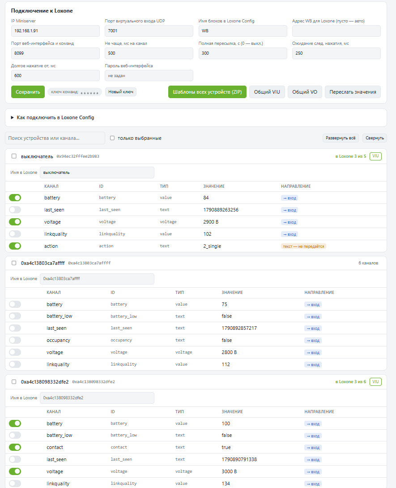
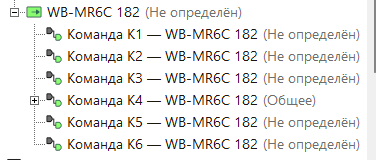
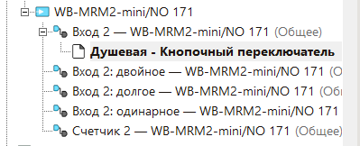

# wb-loxone — устройства Wiren Board в Loxone

[English version](README.en.md)

Мост, который работает прямо на контроллере [Wiren Board](https://wirenboard.com)
и пробрасывает его устройства в [Loxone](https://www.loxone.com) Miniserver:
реле, входы, датчики, счётчики, Zigbee через zigbee2mqtt, виртуальные устройства
wb-rules — всё, что контроллер публикует в MQTT.

Каналы выбираются в веб-интерфейсе. Для Loxone Config мост собирает готовые
шаблоны виртуальных входов и выходов, по одному на устройство. Нажатия кнопок
(одинарное, двойное, тройное, долгое) мост распознаёт сам и отдаёт в Loxone
отдельными импульсами.

```
 устройства WB ──► MQTT ──► wb-loxone ──UDP──► Виртуальный вход UDP   ┐
 (RS-485, Zigbee,           (на WB)                                    │ Loxone
  1-Wire, wb-rules)  ◄────────────────◄──HTTP── Виртуальный выход      ┘ Miniserver
```



* **Состояния — сразу при изменении.** Мост отправляет UDP-пакет в Loxone, как
  только значение поменялось в MQTT. Loxone ничего не опрашивает.
* **Команды — за миллисекунды.** Виртуальный выход Loxone вызывает HTTP на
  контроллере, мост публикует значение в MQTT. Мост тратит на команду единицы миллисекунд.
* **Шаблоны на каждое устройство.** `VIU_<имя>.xml` и `VO_<имя>.xml`: блок в
  Loxone Config назван именем устройства, строки — «канал — устройство».
* **Кнопки.** Число нажатий берётся из аппаратного счётчика модуля, поэтому
  короткие нажатия не теряются даже на медленной шине. Подробно —
  [docs/buttons.md](docs/buttons.md).
* **Ничего не ставится на контроллер.** Один файл на стандартном Python 3.9,
  который уже есть в прошивке. Без pip, без Node-RED, без отдельного сервера.

## Чем это отличается от Modbus TCP (wb-mqtt-mbgate)

Связать WB и Loxone можно и через Modbus-шлюз контроллера, и многие так и делают.
Мост не заменяет его, а закрывает то, что через Modbus неудобно:

| | Modbus TCP шлюз | wb-loxone |
|---|---|---|
| Состояния в Loxone | Loxone опрашивает по циклу | приходят сразу при изменении |
| Кнопки | только состояние входа, двойное/долгое — логикой в Loxone по опросу | готовые импульсы «одинарное / двойное / тройное / долгое» |
| Шаблоны | адреса регистров руками | собираются автоматически, по устройству |
| Zigbee, wb-rules, 1-Wire | нужно настраивать карту регистров | всё, что есть в MQTT |
| Названия | номера регистров | названия каналов и устройств из WB |

Их можно использовать вместе: например, выходы через Modbus, а входы и кнопки
через мост.

## Установка

На контроллере Wiren Board, под root:

```bash
wget -qO- https://raw.githubusercontent.com/megavoltt/wb-loxone/main/install.sh | sh
```

В конце установщик покажет адрес веб-интерфейса — по умолчанию
`http://<IP контроллера>:8099`.

Повторный запуск той же команды обновляет мост. Настройки и выбор каналов
сохраняются.

Требования: Wiren Board 7 или 8 с актуальной прошивкой (проверено на wb-2602,
Debian 11, Python 3.9), Loxone Miniserver Gen1 или Gen2, Loxone Config 16 и новее.

## Первые пять минут

1. Откройте `http://<IP контроллера>:8099`, укажите **IP Miniserver** и нажмите «Сохранить».
2. Разверните устройство и отметьте нужные каналы. Выбор сохраняется сразу.
   Переключатели и кнопки можно проверить прямо со страницы (⇆, ▶).
3. При необходимости задайте устройству **имя в Loxone** — так будут называться
   блок и файлы шаблонов.
4. Скачайте шаблоны: кнопки **VIU / VO** у устройства или **«Шаблоны всех
   устройств (ZIP)»** сверху.
5. В Loxone Config: «Виртуальные входы» → «Импорт шаблона» → `VIU_…xml`, затем
   так же «Виртуальные выходы» → `VO_…xml`. Перетащите нужные входы и выходы на
   страницу программы и сохраните в Miniserver.

После импорта блоки выглядят так — один блок на устройство, строки «канал — устройство»:




Подробнее, с примерами подключения к блокам, — в [docs/loxone.md](docs/loxone.md).

## Документация

* [docs/buttons.md](docs/buttons.md) — кнопки: как распознаются нажатия, настройки, задержки, отладка
* [docs/loxone.md](docs/loxone.md) — импорт шаблонов и подключение к блокам Loxone
* [docs/wirenboard.md](docs/wirenboard.md) — режимы входов модулей, события Modbus, шина RS-485
* [docs/protocol.md](docs/protocol.md) — форматы UDP и HTTP, файл настроек, API веб-интерфейса
* [CHANGELOG.md](CHANGELOG.md) — что менялось в версиях

## Где что лежит на контроллере

| Путь | Что это |
|---|---|
| `/mnt/data/wb-loxone/` | код и веб-интерфейс |
| `/mnt/data/etc/wb-loxone.json` | настройки и выбранные каналы |
| `/etc/systemd/system/wb-loxone.service` | служба |

`/mnt/data` переживает обновление прошивки. После полной перепрошивки (FIT)
запустите установку ещё раз — настройки подхватятся.

```bash
systemctl status wb-loxone          # состояние службы
journalctl -u wb-loxone -f          # журнал в реальном времени
```

Удаление:

```bash
systemctl disable --now wb-loxone && rm -rf /etc/systemd/system/wb-loxone.service /mnt/data/wb-loxone /mnt/data/etc/wb-loxone.json
```

## Безопасность

Мост рассчитан на локальную сеть.

* Веб-интерфейс по умолчанию без пароля — задайте его в настройках, если в сети
  есть чужие устройства.
* Команды от Loxone защищены ключом в адресе (`/set/<ключ>/…`). Мост выполняет
  команды только для каналов, выбранных в интерфейсе, и только для каналов с
  разрешённой записью. Новый ключ можно сгенерировать кнопкой; после этого
  шаблоны VO надо импортировать заново.
* Не открывайте порт моста в интернет.

## Лицензия

[MIT](LICENSE) — можно свободно использовать, в том числе в коммерческих проектах.
